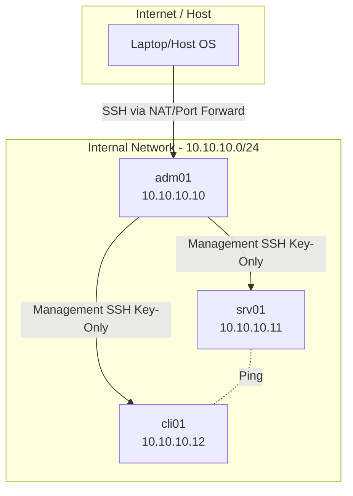

## Topologi Jaringan & Addressing

Sistem ini terdiri dari tiga node yang terhubung dalam satu jaringan internal yang sama untuk komunikasi antar-server, dan satu interface NAT pada admin gateway untuk akses luar.

### Daftar Interface & Alamat IP
| VM Name | Interface 1 (NAT) | Interface 2 (Internal/LAN) | Role |
| :--- | :--- | :--- | :--- |
| **adm01** | DHCP (Internet Access) | 10.10.10.10/24 | Jump Server / Gateway |
| **srv01** | - | 10.10.10.11/24 | Main Service Provider |
| **cli01** | - | 10.10.10.12/24 | End-User Client |

### Alur Akses (Traffic Flow)
1. **Akses Admin:** Administrator masuk ke `adm01` dari mesin host.
2. **Manajemen Internal:** Semua konfigurasi pada `srv01` dan `cli01` dilakukan secara remote dari `adm01` menggunakan protokol SSH melalui jaringan internal.
3. **Keamanan:** Jalur SSH antar-node diproteksi dengan kunci RSA (Key-based authentication) tanpa akses password.